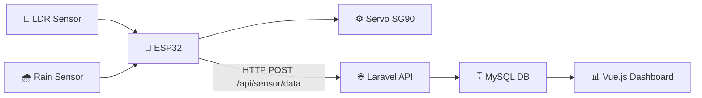
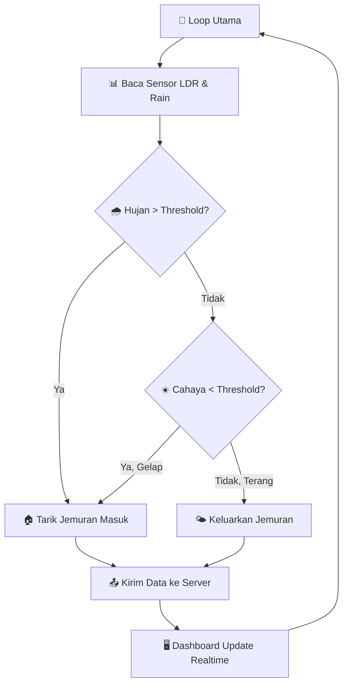

# 🏠 Panduan Lengkap: IoT Jemuran Otomatis ESP32

## Analisis Project Dashboard IoT

Dashboard IoT jemuran otomatis Anda dibangun dengan **Laravel + Vue.js 3** dan memiliki arsitektur berikut:

| Komponen | Detail |
|----------|--------|
| **Backend** | Laravel 11 (PHP), MySQL |
| **Frontend** | Vue.js 3 SPA, Tailwind CSS, Chart.js |
| **API Endpoint** | `POST /api/sensor/data` |
| **Autentikasi ESP32** | Header `X-API-KEY` (diverifikasi oleh middleware `VerifyDeviceKey`) |
| **Database** | Tabel `sensor_logs` (ldr_value, rain_percentage, weather_condition, clothesline_status) |
| **Settings** | Tabel `device_settings` (is_auto_mode, ldr_threshold, rain_threshold, manual_position, device_key) |

### Alur Data ESP32 → Dashboard



---

## ✅ Validasi Kelayakan Komponen

| No | Komponen | Fungsi | Status |
|----|----------|--------|--------|
| 1 | **ESP32 DevKit V1** | Mikrokontroler utama + WiFi | ✅ Sempurna |
| 2 | **Raindrops Sensor Module** | Deteksi air hujan (Analog + Digital) | ✅ Sempurna |
| 3 | **LDR Module Sensor Cahaya** (3 pin: VCC, GND, DO) | Deteksi intensitas cahaya matahari (digital) | ✅ Sempurna |
| 4 | **TowerPro SG90 Micro Servo** | Aktuator penggerak rel jemuran | ✅ Sempurna |

> [!TIP]
> Keempat komponen tersebut **sudah cukup** untuk membuat skenario IoT jemuran otomatis yang terhubung ke dashboard. Tidak perlu komponen tambahan.

---

## 📐 Panduan Rangkaian Kabel Jumper

### Diagram Koneksi Pin

```
╔══════════════════════════════════════════════════════════════════╗
║                    RANGKAIAN WIRING ESP32                        ║
╠══════════════════════════════════════════════════════════════════╣
║                                                                  ║
║   ┌───────────────┐                                              ║
║   │   ESP32        │                                              ║
║   │   DevKit V1    │                                              ║
║   │               │                                              ║
║   │  3V3 ────────────────┬──── VCC LDR Module                    ║
║   │               │      └──── VCC Rain Module                   ║
║   │               │                                              ║
║   │               │      ┌──── VCC Servo SG90 (Merah)            ║
║   │               │      │     [+] Holder Baterai AA x4          ║
║   │               │      │                                       ║
║   │  GND ────────────────┬──── GND LDR Module                    ║
║   │               │      ├──── GND Rain Module                   ║
║   │               │      ├──── GND Servo SG90 (Coklat)           ║
║   │               │      └──── [-] Holder Baterai AA x4          ║
║   │               │                                              ║
║   │  GPIO 14 ─────────── DO LDR Module (Digital Out)             ║
║   │               │                                              ║
║   │  GPIO 35 ─────────── AO Rain Module (Analog Out)             ║
║   │               │                                              ║
║   │  GPIO 25 ─────────── DO Rain Module (Digital Out, opsional)  ║
║   │               │                                              ║
║   │  GPIO 13 ─────────── Signal Servo SG90 (Oranye/Kuning)       ║
║   │               │                                              ║
║   └───────────────┘                                              ║
╚══════════════════════════════════════════════════════════════════╝
```

### Tabel Wiring Detail

#### 1️⃣ Sensor LDR Module → ESP32

| Pin LDR Module | Warna Kabel | Pin ESP32 | Keterangan |
|----------------|-------------|-----------|------------|
| **VCC** | 🔴 Merah | **3V3** | Sumber daya 3.3V |
| **GND** | ⚫ Hitam | **GND** | Ground |
| **DO** (Digital Out) | 🟡 Kuning | **GPIO 14** | Sinyal digital cahaya (LOW=Terang, HIGH=Gelap) |

> [!NOTE]
> Modul LDR Anda hanya memiliki **3 pin (VCC, GND, DO)** — output digital saja. Sensitivitas deteksi cahaya diatur menggunakan **potensiometer kecil (trimpot)** yang ada di modul. Putar searah jarum jam untuk lebih sensitif, putar berlawanan untuk kurang sensitif.

#### 2️⃣ Raindrops Sensor Module → ESP32

| Pin Rain Module | Warna Kabel | Pin ESP32 | Keterangan |
|-----------------|-------------|-----------|------------|
| **VCC** | 🔴 Merah | **3V3** | Sumber daya 3.3V |
| **GND** | ⚫ Hitam | **GND** | Ground |
| **AO** (Analog Out) | 🟢 Hijau | **GPIO 35** | Sinyal analog air |
| **DO** (Digital Out) | 🔵 Biru | **GPIO 25** | Deteksi hujan ON/OFF |

> [!NOTE]
> Raindrops sensor memiliki 2 bagian: **papan sensor** (yang kena hujan) dan **modul kontrol** (yang punya potensiometer). Hubungkan kabel dari **modul kontrol**, bukan langsung dari papan sensor.

#### 3️⃣ TowerPro SG90 Servo → Holder Baterai & ESP32

| Pin Servo SG90 | Warna Kabel Servo | Sambungan | Keterangan |
|----------------|-------------------|-----------|------------|
| **VCC** | 🔴 Merah | **Kabel Merah (+) Baterai** | Sumber daya dari Holder Baterai AA x4 (6V) |
| **GND** | 🟤 Coklat | **Kabel Hitam (-) Baterai & GND ESP32** | Ground Baterai WAJIB disambung ke Ground ESP32 |
| **Signal** | 🟠 Oranye | **GPIO 13 (ESP32)** | Sinyal PWM dari ESP32 |

> [!WARNING]
> **Catatan Penting untuk Power Servo Menggunakan Baterai:**
> - **GND Common (PENTING!):** Kabel Hitam dari Holder Baterai HARUS disambungkan ke kabel Coklat Servo DAN pin **GND** di ESP32. Jika ground tidak disatukan, sinyal PWM dari ESP32 tidak akan terbaca oleh servo (servo akan bergetar atau diam).
> - Kabel Merah (+) Holder Baterai HANYA disambungkan ke kabel Merah Servo. JANGAN hubungkan ke pin 3V3 atau VIN ESP32 agar arus tidak bertabrakan.

---

### Foto Layout Breadboard (Urutan Pemasangan)

**Langkah-langkah merangkai:**

1. **Pasang ESP32** di tengah breadboard (spanning kedua jalur)
2. **Hubungkan jalur power:**
   - Sambung pin `3V3` ESP32 ke jalur `+` (merah) breadboard
   - Sambung pin `GND` ESP32 ke jalur `-` (biru) breadboard
3. **Pasang LDR Module** (3 pin: VCC, GND, DO):
   - VCC → jalur `+` breadboard
   - GND → jalur `-` breadboard
   - DO → kabel jumper ke `GPIO 14`
   - **Atur potensiometer** pada modul LDR sesuai sensitivitas yang diinginkan
4. **Pasang Raindrops Module Control Board:**
   - VCC → jalur `+` breadboard
   - GND → jalur `-` breadboard
   - AO → kabel jumper ke `GPIO 35`
   - DO → kabel jumper ke `GPIO 25`
5. **Pasang Servo SG90 (Power Baterai AA x4):**
   - Merah (VCC Servo) → hubungkan langsung ke kabel merah (+) Holder Baterai.
   - Coklat (GND Servo) → hubungkan ke jalur `-` breadboard (yang sudah terhubung ke GND ESP32) DAN kabel hitam (-) Holder Baterai.
   - Oranye (Signal Servo) → kabel jumper ke `GPIO 13` ESP32.

---

## 📚 Library Arduino IDE yang Dibutuhkan

### Langkah 1: Install Board ESP32

1. Buka **Arduino IDE**
2. Buka **File → Preferences**
3. Di kolom **"Additional Board Manager URLs"**, tambahkan:
   ```
   https://raw.githubusercontent.com/espressif/arduino-esp32/gh-pages/package_esp32_index.json
   ```
4. Buka **Tools → Board → Board Manager**
5. Cari **"esp32"** → Install **"esp32 by Espressif Systems"** (versi terbaru)

### Langkah 2: Install Library

Buka **Sketch → Include Library → Manage Libraries** dan install:

| No | Library | Versi | Fungsi | Cara Install |
|----|---------|-------|--------|--------------|
| 1 | **ESP32Servo** | ≥ 1.1.2 | Kontrol servo PWM di ESP32 | Library Manager → cari "ESP32Servo" |
| 2 | **ArduinoJson** | ≥ 7.0.0 | Membuat JSON payload untuk HTTP POST | Library Manager → cari "ArduinoJson" by Benoît Blanchon |
| 3 | **WiFi** | *Built-in* | Koneksi WiFi ESP32 | Sudah termasuk dalam board ESP32 |
| 4 | **HTTPClient** | *Built-in* | HTTP request ke server | Sudah termasuk dalam board ESP32 |

> [!IMPORTANT]
> Library **WiFi** dan **HTTPClient** sudah otomatis tersedia setelah install board ESP32 di Board Manager. Anda **TIDAK** perlu install terpisah.

### Langkah 3: Konfigurasi Board di Arduino IDE

| Setting | Nilai |
|---------|-------|
| **Board** | ESP32 Dev Module |
| **Upload Speed** | 921600 |
| **CPU Frequency** | 240MHz (WiFi/BT) |
| **Flash Frequency** | 80MHz |
| **Flash Mode** | QIO |
| **Flash Size** | 4MB (32Mb) |
| **Partition Scheme** | Default 4MB with spiffs |
| **Port** | COM* (pilih port ESP32 Anda) |

---

## 🔧 Konfigurasi Firmware Sebelum Upload

Buka file [jemuran_otomatis.ino](file:///c:/Users/riska/Desktop/IOT/esp32_firmware/jemuran_otomatis.ino) dan ubah 3 hal penting ini:

### 1. WiFi Credentials
```cpp
const char* WIFI_SSID     = "NAMA_WIFI_ANDA";       // ← Ganti ini
const char* WIFI_PASSWORD  = "PASSWORD_WIFI_ANDA";   // ← Ganti ini
```

### 2. Server URL (IP Laptop Anda)
```cpp
const char* SERVER_URL = "http://192.168.1.100:8000/api/sensor/data";  // ← Ganti IP
```

Cara mencari IP laptop:
1. Buka **CMD** di laptop
2. Ketik `ipconfig`
3. Cari **IPv4 Address** di adapter WiFi Anda (contoh: `192.168.1.100`)
4. Pastikan Laravel server berjalan: `php artisan serve --host=0.0.0.0 --port=8000`

> [!CAUTION]
> **PENTING:** Gunakan `--host=0.0.0.0` saat menjalankan Laravel, bukan default `127.0.0.1`. Ini agar ESP32 bisa mengakses server dari jaringan lokal.

### 3. API Key
```cpp
const char* API_KEY = "GANTI_DENGAN_API_KEY_DARI_DASHBOARD";  // ← Salin dari dashboard
```

Cara mendapatkan API Key:
1. Login ke dashboard IoT
2. Buka halaman **Settings (Sistem & Kalibrasi)**
3. Di bagian bawah, terdapat **"Otentikasi Mesin (ESP32 API Key)"**
4. Salin kunci API tersebut

---

## 🔄 Alur Kerja Sistem



### Mapping Data ke Dashboard

| Data ESP32 | Field API | Tampilan di Dashboard |
|------------|-----------|----------------------|
| `ldrValue` (0-100%) | `ldr_value` | Gauge "LDR Matahari" |
| `rainPercentage` (0-100%) | `rain_percentage` | Gauge "Volume Air" |
| `weatherCondition` | `weather_condition` | Badge cuaca di hero banner |
| `clotheslineStatus` | `clothesline_status` | Status utama "Di Dalam" / "Di Luar (Menjemur)" |

### Nilai Weather Condition yang Dihasilkan

| Kondisi | Kapan Muncul |
|---------|--------------|
| "Cerah Terik" | LDR ≥ 70% dan tidak hujan |
| "Cerah Berawan" | LDR ≥ threshold dan < 70% |
| "Mendung" | LDR 20-threshold% |
| "Gelap/Malam" | LDR < 20% |
| "Gerimis" | Rain threshold-30% |
| "Hujan Sedang" | Rain 30-60% |
| "Hujan Deras" | Rain ≥ 60% |

---

## 🚀 Checklist Menjalankan Sistem

- [ ] **Hardware**: Semua kabel tersambung sesuai diagram
- [ ] **Arduino IDE**: Board ESP32 dan library sudah terinstall
- [ ] **Firmware**: WiFi SSID, Password, IP Server, dan API Key sudah diisi
- [ ] **Upload**: Upload firmware ke ESP32 (klik tombol Upload di Arduino IDE)
- [ ] **Laravel**: Server berjalan dengan `php artisan serve --host=0.0.0.0 --port=8000`
- [ ] **Database**: Migration sudah dijalankan (`php artisan migrate --seed`)
- [ ] **Monitor**: Buka Serial Monitor (115200 baud) untuk melihat log ESP32
- [ ] **Dashboard**: Buka browser di `http://localhost:8000` untuk melihat data realtime

> [!TIP]
> Dashboard melakukan polling data setiap **2 detik** dan ESP32 mengirim data setiap **5 detik**. Anda akan melihat pembaruan data hampir secara realtime di dashboard.

---

## 🐛 Troubleshooting

| Masalah | Solusi |
|---------|--------|
| ESP32 tidak terdeteksi di Arduino IDE | Install driver **CP2102** atau **CH340** (sesuai chip USB di board) |
| WiFi gagal tersambung | Pastikan SSID dan password benar, ESP32 hanya support WiFi **2.4GHz** |
| HTTP Error 401 | API Key salah. Salin ulang dari halaman Settings dashboard |
| HTTP Error -1 (Connection Refused) | Jalankan Laravel dengan `--host=0.0.0.0`. Pastikan IP laptop benar |
| Servo bergetar / tidak bergerak | Periksa sumber daya servo. Coba gunakan sumber 5V terpisah |
| LDR selalu TERANG/GELAP | Putar potensiometer (trimpot) pada modul LDR untuk kalibrasi sensitivitas. Jika logika terbalik (DO=HIGH saat terang), ubah di firmware: ganti `== LOW` menjadi `== HIGH` pada `readSensors()` |
| Data tidak muncul di dashboard | Periksa Serial Monitor ESP32 untuk error. Cek `php artisan route:list` |
